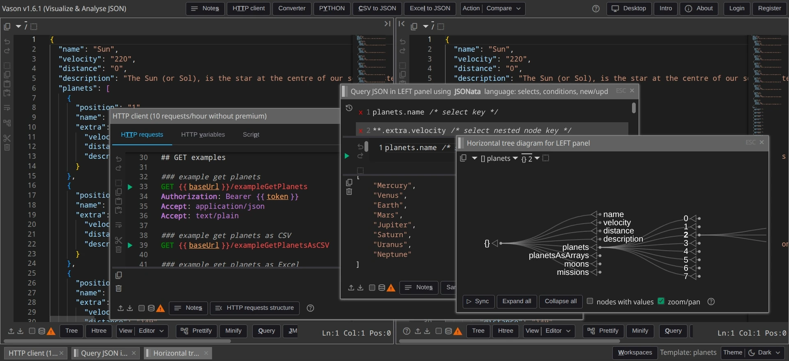

# About Vason Team

## Who we are

We are a group of passionate software engineers with many years of experience in developing complex and novel software solutions
Our expertise spans several areas of software engineering, including but not limited to:

- Backend Development
- Frontend Development
- Continuous Integration / Continuous Delivery
- Database Design
- ETL Process Design
- Language Parsing
- and more...

## Our projects

### [Vason.io](https://vason.io)

{.light-only}
{.dark-only}

Vason is a powerful tool for IT professionals that enables efficient analysis and visualization of JSON data.
It supports operations like selection, joining, aggregation, and conversion, similar to database queries,
and works with data from files, clipboards, or APIs. Vason also includes a scripting system for
automation and increased productivity.

### Vason Sheets

```
Coming soon!
```

---

::: tip
If you're seeking a team capable of delivering high-quality,
production-ready software systems tailored to your needs, we’d be happy to connect.
Please feel free to [contact us](./contact-us).
:::
