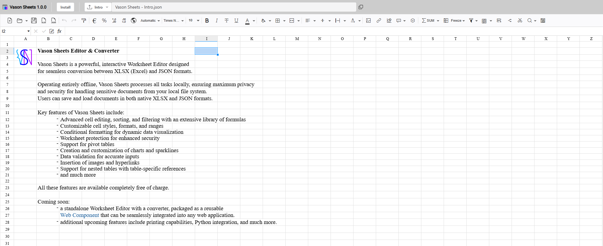

# Projects developed Vason Team

## [Alljson](https://alljson.com)

{.light-only}
{.dark-only}

Alljson is a powerful tool for IT professionals that enables efficient analysis and visualization of JSON data.
It supports operations like selection, joining, aggregation, and conversion, similar to database queries,
and works with data from files, clipboards, or APIs. Alljson also includes a scripting system for
automation and increased productivity.

<lite-youtube videoid="P94cFu61tuo"/>

## [Vason Sheets](https://sheets.vason.io/)

Vason Sheets is a powerful, interactive Worksheet Editor designed for seamless conversion between XLSX (Excel) and JSON formats.

Operating entirely offline, Vason Sheets processes all tasks locally, ensuring maximum privacy and security for handling sensitive documents from your local file system. Users can save and load documents in both native XLSX and JSON formats.

Key features of Vason Sheets include:
- Advanced cell editing, sorting, and filtering with an extensive library of formulas
- Customizable cell styles, formats, and ranges
- Conditional formatting for dynamic data visualization
- Worksheet protection for enhanced security
- Support for pivot tables
- Creation and customization of charts and sparklines
- Data validation for accurate inputs
- Insertion of images and hyperlinks
- Support for nested tables with table-specific references
- And much more

All these features are available completely free of charge.

Vason Sheets can also be installed and used as a desktop application (PWA).

Coming soon: 
- A standalone Worksheet Editor with a converter, packaged as a reusable web component that can be seamlessly integrated into any web application. 
- Additional upcoming features include printing capabilities, Python integration, and much more.

---

::: tip
If you're seeking a team capable of delivering high-quality,
production-ready software systems tailored to your needs, we’d be happy to connect.
Please feel free to [contact us](./contact-us).
:::
